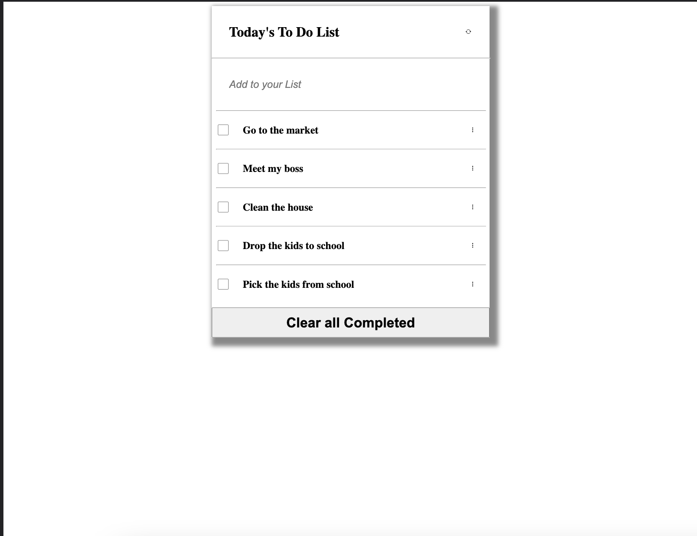

# To_do_list_webpack
This is a to do list implemented using webpack 

# Awesome-books-beta

> This is a to do list implemented using webpack bundler

## Screenshot

<!-- 
 -->

## Built With

- Major Languages: JAVASCRPT, HTML, CSS
- Major Technologies : Git, Github

## Live Demo (if available)

[Live Demo Link](https://livedemo.com)

## Getting Started

**Clone the repository and setup the linter**

To get a local copy up and running follow these simple example steps.

### Prerequisites
- npm ( Node Package Manager )
- git and Github Account

### Setup

To get a local copy up and running follow these simple example steps.

- Open terminal
- Change the directory you want put the repo
- Then run
  i. Run git clone git@github.com:richardoppiyo/To_do_list_webpack.git
  ii. cd repo-name/

### Install

- **Webhint** linter

  `npm install --save-dev hint@6.x`

- **Stylelint** linter

  `npm install --save-dev stylelint@13.x stylelint-scss@3.x stylelint-config-standard@21.x stylelint-csstree-validator@1.x`

- **ESLint** linter

  `npm install --save-dev eslint@7.x eslint-config-airbnb-base@14.x eslint-plugin-import@2.x babel-eslint@10.x`

 - **luxon** libray

    `npm install --save luxon`

### Run tests
- **Webhint** linter -`npx hint .` on the root of your directory of your project.
- **Stylelint** linter
  - `npx stylelint "**/*.{css,scss}"` on the root of your directory of your project.
- **ESLint** linter
  - `npx eslint .` on the root of your directory of your project.

## Authors

👤 **Author1**

- GitHub: [@richardoppiyo](https://github.com/richardoppiyo)
- Twitter: [@blessed_ricky](https://twitter.com/blessed_ricky)
- LinkedIn: [Richard Opiyo](https://linkedin.com/in/richardoppiyo)

## Show your support

Give a ⭐️ if you like this project!

## Acknowledgments

- To morning session team,reviewers and standup team memebers.

## 📝 License

This project is [MIT](./MIT.md) licensed.